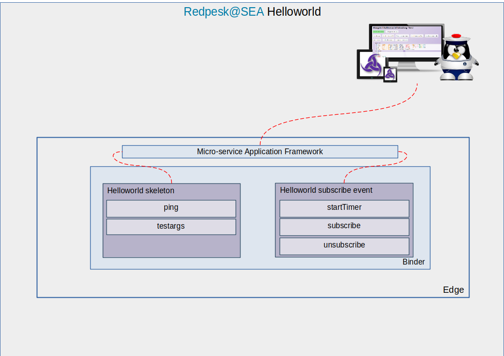

# Helloworld service

## Architecture

This service is an example of binding.

There are two binding in the helloworld service. Here is the architecture of this service. Helloworld skeleton and helloworld subscribe event are represented in the binder with their corresponding verbs:

